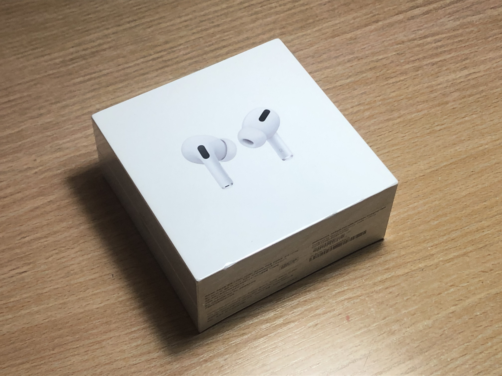
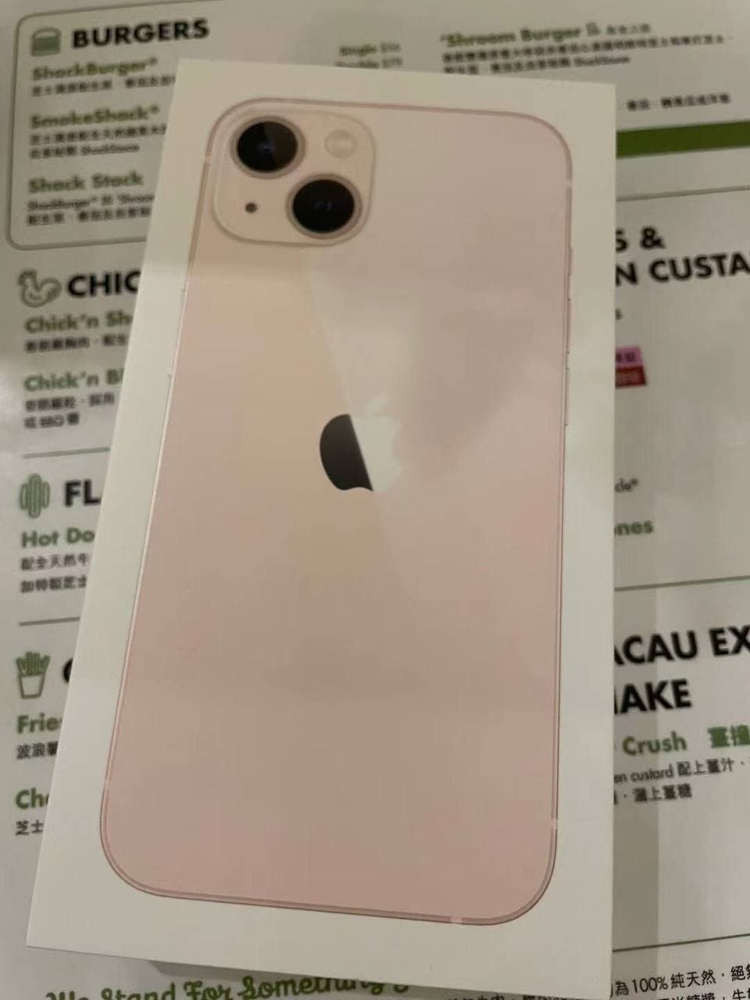
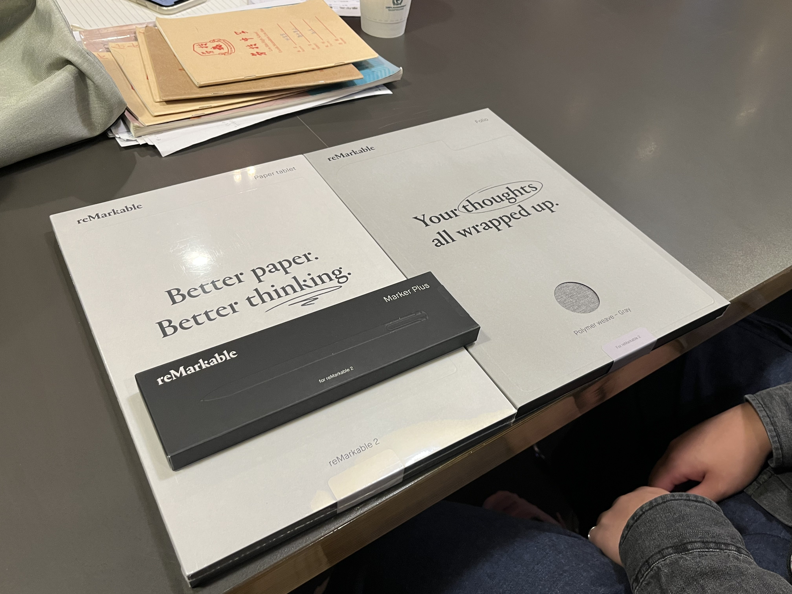

# 楔子
照理来说，年终总结这种东西应该在一年的最后一天写的，但考虑剩下不到半个月的时间应该都是在碌碌无为的考试月备考中度过，就决定提前写下这篇年终总结。

<!--more-->

今年发布的博文数量很少，并不是因为我没有时间写,而是在我使用静态博客的体验过程中，敲下新建博文的命令，打开编辑器的时候，却脑子一空什么都写不出来，这可能也是我今年居然只写了一篇博文的原因之一吧。Anyway, 那么就让这第二篇博文给 2021 年画下一个句号吧。

# 一模，二模，三模，四模，高考；
今年的前半年，我都是在无尽的高考复习之中度过的，感觉每天都过得一模一样，那时的我已经对于时间的流逝完全失去了认知。其实高考完之后回顾我的备考过程，直到高考前的一个月，我其实都没有达到“一个真正的高三备考生”应有的样子，每天都很忙碌，时间也都是花在学习上，但是学习效率并不是很高。

留下的除了一大箱的课本和卷子以外，还有一些药盒子。
应该就在今年年初的时候，我感觉精神状态确实不太好，就去了一下大医院去看了一下，诊断结果大抵是没有什么严重的问题，医生开了 Zolpidem 来缓解我严重的失眠问题。药物的耐受性比我想象中要来得更早，大概吃了一盒半之后我对于这个药就没什么反应了，之后又去广东省精神卫生中心开了新药，之后每天服药就是我的常态了。

回顾这一段经历，我挺感谢在高中为数不多的朋友们的。有一位朋友这方面的病情比我严重很多（重度抑郁+双相情感障碍），但是还是在相互鼓励中都成功撑过了高考，也算是很幸运的一件事情了吧。

除此之外，还是得感谢一下许多补习老师的悉心教导和热情鼓励。可能没有这些鼓励，我觉得我也很难撑到考完。

高考那几天过的很快，考完之后，感觉很恍惚。现在自己居然这么轻易地就能够离开这压迫我三年、我曾经痛恨、厌恶的地方了，一切都变得这么轻松。对于即将和同学们的分别，我没有了以往离别时的悲伤，空气中洋溢着之前在学校里不曾有过的自由气息，大家都在为庆祝高考的结束而匆忙赶路，看来不少人也和我一样，对这个折磨了自己三年的地方没有什么留恋之情。

# The summer vacation; Vanished; Epidemic;
这个可能一个中国学生中最长的假期，我已经期待了至少六年，多亏了 COVID-19，这一个暑假基本上就是在宅家、躺平中荒废掉了。

暑假期间唯一一次有印象的出游，应该就是和小学同学去了一趟澳门，应该算是我第一次去澳门玩吧。
不过就我个人而言，素有“半个解放区”之称的澳门确实并没有给我当时去香港时那种震撼，人文素养、社会秩序和东西方文化的交融可能是澳门为数不多能让我留下深刻印象的内容了。

宅家的时间里，我真的感觉自己什么事情都没有做成，报名了驾校，但也是在开学之后才去考了科目一，总之这个暑假可能是我对我自己最失望的一个暑假了。

暑假期间还有一个比较大的遗憾可能就是没能把握住机会去武汉见最想见的推友了。我记得当时算是多股疫情之间的 interval，这给我最大的教训就是“犹豫就会败北”了，不过也会出现人算不如天算的情况，~~当然，如果当时高考系统没把我投档的话我也可能因此没书读了（那个时候正值补档申报期）。~~

# 大学生活，幻想的破灭；
说实在的，可能初三到高一的那一段时间是我对于大学生活最期待的时候了，从初中开始，我就逐渐喜欢上摄影，并且非常期待我在大学时期能有充足的时间来把玩和研究。不过在高考之前，我就参考了许多人的生活经历。幻想早已破灭了。

Enroll 之后的军训就是噩梦的开始，每天的炎热天气和暴晒让我这个宅家几个月的人很不适应应该也没几个人能适应吧。当然，我用各种手段陆陆续续请了 5 天的假，相比于他人算是轻松了不少。

开学之后的生活可谓是乏善可陈，学生组织的招新面试我也参加了两三次，但居然都被拒绝了 说明我是真的菜，10 月的那一个月去参加了院里面辩论队的新生赛，虽然我觉得自己表现得一般般，但没想到被队长相中把我拉进队里面了。不过这一个学期下来也没什么活动，咸鱼组织实锤了。

剩下的日子里，大概由每天较为充实的 Weekdays 和零星的美好周末组建而成了。

# 我买了什么
- AirPods Pro ~~無綫貓耳~~

这副耳机是我大概今年三月左右买的。当时备考压力挺大的，我就想买一副降噪耳机，并且因为我有佩戴 Apple Watch，正好可以在跑步的时候听歌了，一模考试之后每天下午的 2km 跑步是戴着它来听音乐。

- Lenovo 小新 Pro 16-ACH

小新 Pro 16 是暑假时我买的工作用机，上了大学之后几乎每天都需要用它，编程作业、文档图表、幻灯片什么的，都是在它上面完成的，当然也用它来打游戏。买回来的时候并没有特地拍照，只是觉得这是一台外表朴实无华但是几乎是我目前最重要的设备了。

当然，我的静态博客部署也迁移到了这台设备上。

- Intel AX200

这是 Intel 家支持 802.11ax 的无线网卡，当时买到小新 Pro 16 之后发现只要一合盖 WiFi 就会断连，而且无线网路性能差得离谱。最后判断是这台小新搭载的 RTL 网卡过于乐色。~~甚至这个网卡没办法在螃蟹官网找得到~~

我大概花了一个小时才边摸索边把机器拆开来，换卡大概用了 2min 不到吧。

在更换完网卡之后体验确实好了许多，起码不会合盖之后就 WiFi 断连了，并且有 WiFi 6 的加持，效果立竿见影。

- Redmi AX6000

这是一个支持 WiFi 6 的无线路由器，没什么特别的，可能比较大的遗憾就是 Redmi 的路由器刷入 OpenWRT 系统还是很麻烦，我就索性没去弄了。

- iPhone 13

新的手机，之前的 iPhone 8 因为电池高度老化（76% Battery effeciency），再加之更新系统之后日常使用十分卡顿，正好听说在澳门的同学要去 Apple Store，就直接找同学帮个忙走私了回来。

我选择了粉色，这次苹果算是抓住了猛男美少女的心了，这个粉色调制得相当不错，优雅而不浓郁，清新而不平庸。在 Apple Store 上手摸了之后，我就铁了心要选择这个配色。当然正好这成了这代普通款 iPhone 的限定配色，购买之时国内的库存基本上都没有。

在写下这篇博文的时候，我对于这台手机的新鲜感已经全无了，它就是一台中庸的水桶机，没有什么短板，没有什么痛点，但也没有能让我惊艳的地方。

- reMarkable 2

这可能是今年我买到的最能让我兴奋的产品了，在十一月底的时候我趁着 Black Friday 促销花了 3776 HK$ 入手了，在经过三天的快递运输和四天的转运之后从香港到了澳门，我也是一路风尘仆仆地跑到了澳门，提货时的兴奋不言而喻，可能这一路奔波也增加了我对它的期望吧。

这里不讲太多，可能下个月我还会写一篇 Review 来更详细地阐述关于它的事情。

# 展望 2022
无论有没有达成，新的一年总需要对自己有一些期望吧
1. 考取机动车驾驶证

2. IELTS Band 6+

3. 学科类额外学习

    - 线性代数 （Linear Algebra & Its Application）进度推完
    - CSAPP 进度推完
    - 至少参与一次科研和实习
    （发 paper 就不奢望了）

4. 如果还有机会的话，把 HKUST Credit Transfer Application 递交

5. 写至少三篇博文

6. 学会 LaTeX

# 写在最后
> 悟已往之不谏，知来者之可追。

————陶渊明 《归去来兮辞》

