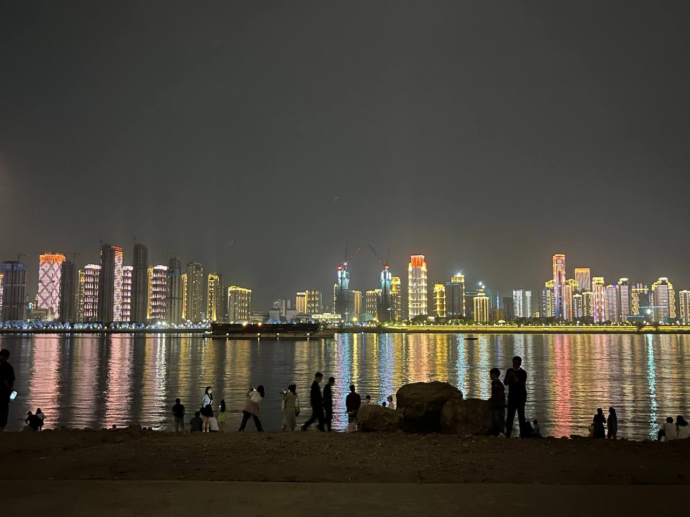
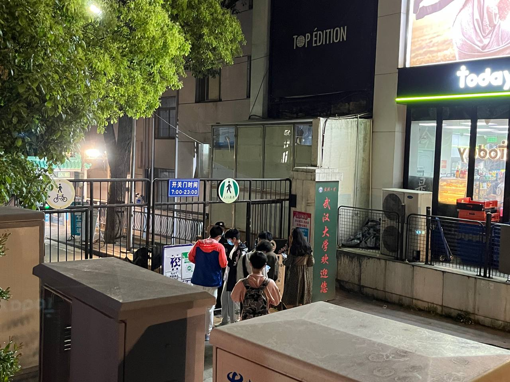
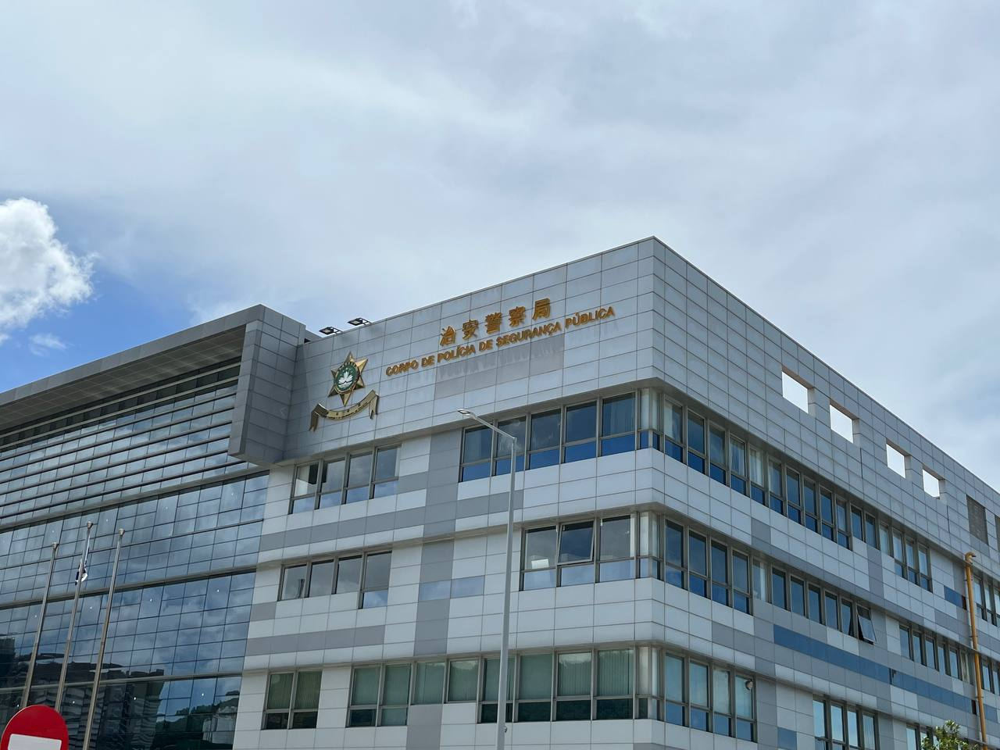

> 每一个不曾起舞的日子，都是对生命的辜负。

————尼采

2022 这一整年，我对我自己辜负得太多了，但是我不打算为自己找开脱的理由，因为这一切都是咎由自取。

回顾去年年关的展望，今年仅仅完成了“写三篇 blog”这一条，LaTeX 的使用也算是能应付日常使用了，其余的计划均没有完成。
当时的雄心壮志终究还是敌不过自己的懒惰和现实情况的复杂，所以今年我不打算制定下一年的计划了。

今年二月去澳门大学“蹭课”，见到了近四年没见的初中好友，那一天我和他坐在何鸿燊书院门前的公园里，聊到了之后的规划。晚冬的海风还是有些许寒冷，而不知道如今的寒冬何时才会过去。

四月，清明节后的第一个周末只身前往武汉和式君面基。早上我就在大学门口等，四月的武汉比我想象中要热一点，我大概等了半个小时就已经汗流浃背了，但到今天我还是能回想起来当时期待而不安的心情，~~大概就像等待恋人的心情一样吧~~，晚上一起在江滩看夜景，最后在大学门口告别。

我能说那一天玩得很开心吗？起码当天我觉得很开心，但是后来因为一些原因最终不欢而散。而如今回想起来，虽然早已和自己和解，但仍然有遗憾和痛苦残留于心。

五月底又去了一趟澳门，但这次旅途真是多灾多难，我的身份证、往来港澳通行证和两张信用卡都丢了，本来打算在澳门玩一天，结果半天都用于处理证件和银行卡挂失的问题，第一次和澳门治安警察打了交道，也是第一次尝试用粤语完成整个沟通流程，算是挺特别的一次体验（？

今年还入坑了 maimai DX 这款街机音乐游戏，还是挺让我兴奋的，我承认自己并不是一个特别喜欢玩游戏的人，主要是我觉得大部分优质的游戏都很消耗精力，而这一款音游给我带来的快乐还是蛮大的，虽然打街机比手游要花的钱多很多，不过我仍然很推荐别人来一起玩 maimai。

上了大二之后明显感觉课程难度上了一个台阶，之前本来信心满满地计划这学期学一些基础的计算机课程，结果到了动笔写下本篇年终总结只是仅仅看了两节 CS50 的网课，现在我已经完全接受了自己时间管理无能的这一事实。

2022 后半年疫情的肆虐与严格的管控措施占据了半个学期的时间，从十月底开始我所在的广州就开始大爆发，整个十一月大概只有一周多的时间能离开学校，作为一个放荡不羁的大学生，我自然无法忍受囚禁于围墙内的生活。而在十二月，随着当局对于管控的放开，我又在居家学习中消磨了一个月，在 2022 年的年关结束了大二上学期。

今年是孤独的一年，高中的同学很少再有往来，知音难觅是这个世界的常态，但我还是很庆幸能遇到几个有趣的人，几个晚上的信步闲聊，几本诗集，还是能让我在美丽的记忆碎片中独自意淫。我对于别人的期望越来越低，维系人际关系已经不会像小孩子的友情那样简单纯真了，心之壁的隔阂，需要多么大的努力才能跨越！

2022 年即将结束，虽然我不想制定下一年的目标，虽然今年仍然一事无成，但还是要对自己有所希冀。希望 2023 年的我能够更加勇敢、不再蹉跎岁月，向自己所向往的样子前进。