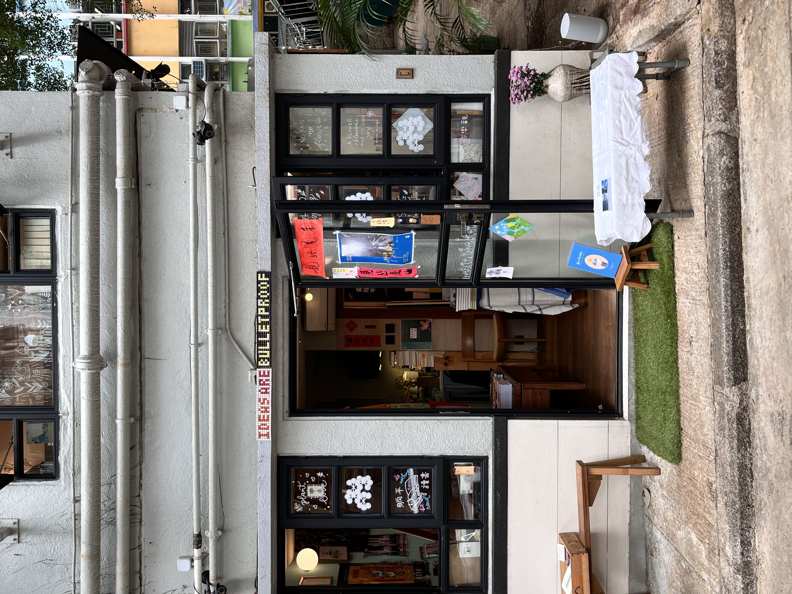

这期书影音总结总算是姗姗来迟地来了，为什么今年二、三季度要合成一篇呢？说来惭愧，那肯定是因为鄙人实在是过于懒散而没怎么读书。这个时代读书不易，但愿能继续写下去。

## 书籍

- 公民司法認知：由起訴到審訊的香港法律101，[法庭線](https://thewitnesshk.com/%E5%85%AC%E6%B0%91%E5%8F%B8%E6%B3%95%E8%AA%8D%E7%9F%A5-%E9%8A%B7%E5%94%AE%E6%B8%A0%E9%81%93%E5%85%A7%E5%AE%B9%E7%B0%A1%E4%BB%8B%E5%8F%8A%E8%A9%A6%E8%AE%80/) 出版

很有意思的面向普罗大众的司法科普书籍，主要介绍香港的一些法律常识和司法流程。对于香港市民读者有助于加深了解香港司法的运作机制，培养基本的理解和认知；而对于来自中国大陆的读者，能够从中一窥普通法系与中国法律的差别。

这本书给我一种很强的异域感，这也是这本书吸引我的重要原因。如今能以中文的形式接触到这种异域感实在难得，

- 大時代的蜉蝣，見山出版	[豆瓣页面](https://book.douban.com/subject/35818946/)

今年三月我在 Instagram 上看到见山书店准备于当月月末结业，就择日赴上环拜访。书店很小，毕竟上环寸土寸金，况且是独立书店，楼梯只能容纳 1.5 个人的宽度。

买这本书的契机也是很无厘头，有位顾客进来选了这本书的时候店长说只剩最后三本，我看了一下周保松先生为其写的序言就直接买了。

摘自周保松先生所撰序言：

> 邵頌雄的文章有多好？這個我不談，要靠讀者自己體會。不過，文如其人，我讀邵君最大的愉悅，也是最大的得這着，是見到一個人如實、用心地活著，是怎樣一種境界。

## 电影

- 通往夏天的隧道，再见的出口	[豆瓣页面](https://movie.douban.com/subject/35705627/)

早在去年已经在电脑上看过，我也买了它的中译本小说，这次是在院线观影。

电影票

## 播客

- 一天世界 - [EP87: 我的朋友都在用抖音，爲什麼我不能用？](https://yitianshijie.net/episodes/87)

我从来没有用过抖音 / TikTok，我也一直反对身边的人使用抖音，原因无它，只是深知短视频对于人脑的危害极大。不过这个时代谁都很难真正逃离短视频，有时在 Bilibili 上找一些资料或一些视频博主仅以短视频的形式呈现。想要避免成瘾也很简单，你只需要一台电脑以代替手机阅览这些内容。
