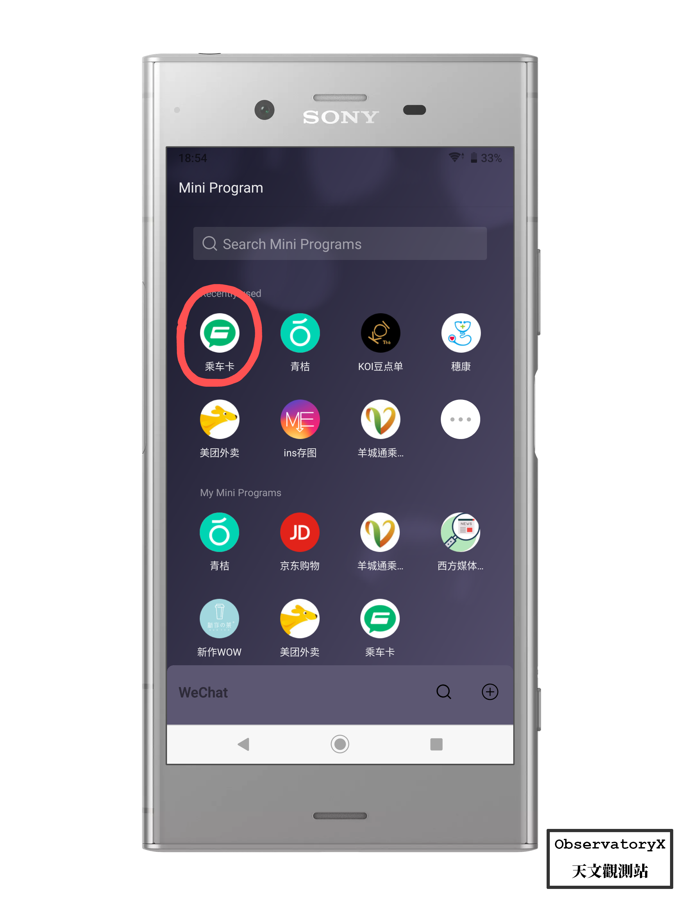

# 前言

传统的公共交通卡使用形态就是“一触即过”，所以我心目中手机端能代替公交卡使用的解决方案必须能达到近似或媲美普通公交卡才行。

但是目前 Android 设备并没有一个泛机型的一个解决方案来实现最优雅的手机刷公交的方案。

MiPay 或者 HaweiPay 都是通过内部定制和公司与交通部门的合作实现的。（当然 Apple Pay 也不例外）

但是似乎在今年，疼讯公司搞了一个小程序用来解决 NFC 刷公交的问题。

“乘车卡”这个小程序支持了交通联合的公交卡，意味着全国大部分地区的公共交通扣费都可以使用它。

## Requirement
首先你得使用微信（当然对于大部分人来说这个要求和没有一样），因为扣款都是通过微信支付进行的。
同时你需要有一台支持 NFC 功能的 Android 手机，这个要求最为重要且很多人都可能无法达到，Android 手机搭载 NFC 的占比其实并不高。

## 为什么要使用接触式公交卡？
这个时代是二维码的时代，二维码凭借其可用性强、不受设备约束的特性迅速占领了中国的支付方式、网页跳转、信息认证等领域，但是二维码是实体与互联网的桥梁，基于二维码的互联网信息交换服务都需要连接网络。在没有网络的地方，二维码就相当于一张白纸。

## 使用
经过博主的测试，这个软件必须在确保手机解锁且小程序在前台运行时才有效（当然需要打开 NFC 功能），在 BRT、APM 这类一触即扣费的公共交通服务支持良好，且能兼容地铁这类费用由路程决定的出站收费制服务。

# 优势
1. 能近似达到公交卡的体验 “一触即过”
2. 扣费方便，直接从微信支付扣款
3. 服务地区广（支持交通联合）

从个人而言，我并不怎么喜欢以二维码为基础的网路服务，例如微信支付的二维码，为了防止被盗用，必须联网更新 token 来确保安全。扫码这个动作缺乏了传统上现金支付和信用卡支付的那种仪式感，付款之后只有屏幕上的一个弹窗，索然无味，且低级感十足。

支付的过程应该充满良好的体验，Apple Pay 付款时会有震动和极其令人舒适的“ding”一声，才有一种付了款的感觉，而二维码这种扫码支付没有付款的感觉，也更容易对付款产生麻木。