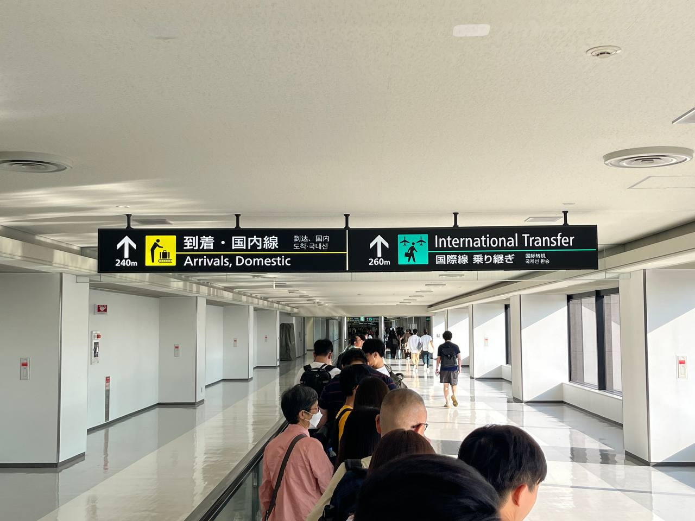
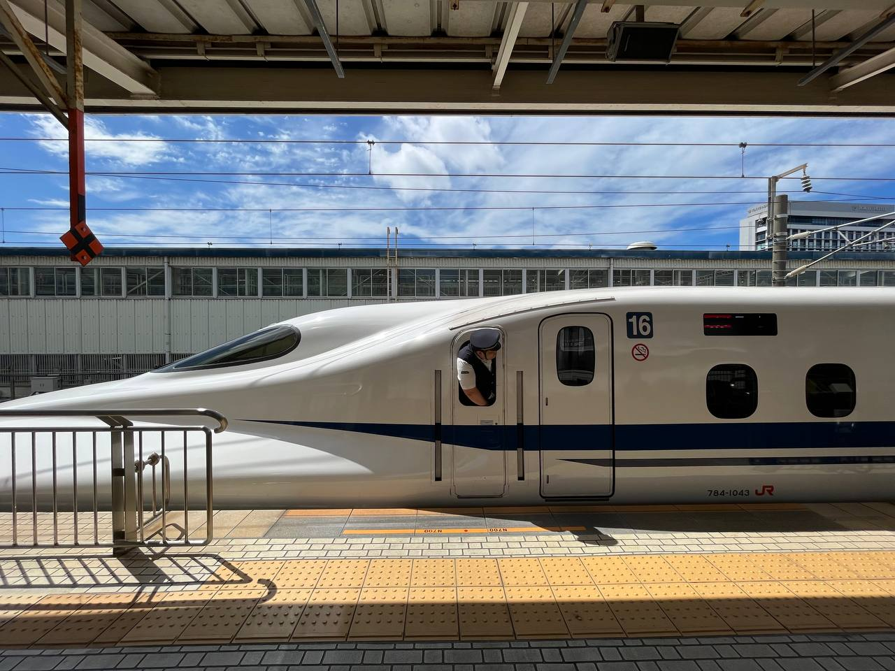

又到年末，本台的惯例是该写一篇年终总结了，如果不出所料这篇总结会在今年的最后一日发布，相比于不少友台算是比较晚的了。

## I continue my school life

从大二到大三，我的校园生活基本照旧，总体来看算是平淡中夹杂着些许精彩。除了上课、做实验和班上同学打交道以外，也就只剩下辩论队里的朋友们了，有和学弟学妹一起露营团建，也有和学长一起打表演赛。残存的记忆不多，大概是当翻看手机里的相片时才能想起来比较开心的回忆吧。

## I take IELTS test

今年年初主要在忙着备考雅思考试，这是我第一次考雅思。虽然从很早就开始有复习，但是真正有成效的推进都在考前三周，最后考出来的成绩和我自己的预计差不多。本来想申请去 HKUST 和 CityU 当自费交换生，不过前者没要我，后者要递交高中成绩单就劝退了。

选择香港考场主要是不喜欢打视频电话的口语考试形式，当时大陆考场还未设置 Face to Face 的 session。

<blockquote class="twitter-tweet">
好耶 <a href="https://t.co/z3LAMPBrGS">pic.twitter.com/z3LAMPBrGS</a>
&mdash; 汐 (@Leviticus_Aru) <a href="https://twitter.com/Leviticus_Aru/status/1640603664682467330?ref_src=twsrc%5Etfw">March 28, 2023</a></blockquote> 

## I travel to Japan

疫情解封之后的第一次出国旅行献给了日本，日本算是我心心念念的旅行目的地。这次旅行持续了两周，从东京沿着东海道新干线一路向西，在大阪结束旅程。见过了国际大都会，也乘坐单线铁道和村里的巴士进山观察农村的样貌，感受了停办了三年后隅田川花火大会的人潮，也体验到了山中温泉的舒适。

在日本旅行的两周可以说如梦幻一般，曾经无数屏幕之下的绘画成为了眼中的现实，一切都是那么美妙而那么容易幻灭。我会想说日本是我目前最想再去也一定会再去的目的地了。

## I drive

这个暑假终于拿到了中国驾照，从报名到最终拿证过了两年多，然而真正的上车考试全都在今年初的寒假和年中的暑假，其中科目二考了三次，前面都是犯了那种一错即挂的项目。在考完路考之后本来想直接去文明考，结果是遇到考场电脑宕机，拖到了从日本旅行回来了才拿到驾照。不过平时开车的机会也不多，现在在考虑等到明年实习期过了之后免试换取香港驾照。

## I take photos

今年有一直坚持学习摄影，虽然个人觉得没有什么进步，有的时候回看高中拍的照片都感觉比现在的自己拍得要更好，去年和年初的时候当时处于一种毫无思绪和热情的状况，执笔写下本文时的自己已经少了些许焦躁和不安感。

我开始购买摄影书和图鉴，开始了解摄影史。下半年我自己最大的一个变化大概就是心境的变化，之前有为了“摄影”而出门拍照，很多时候在街上漫无目的地逛了一圈心情也会因为没什么出片而烦躁；看开了之后倒无所谓出片效率，不再苛求自己之后也更愿意拿相机出门了。拍不出好片的时候不一定着急要求多拍，而是多想、多看。摄影，放下相机也很重要。

## I watch expos and operas

今年我特别喜欢去看展会，主要是文物展和摄影展，绝大部分参观都是一个人去。展会内容固然是吸引我去看的主要原因，可能我也非常享受一个人看展时独立探索的感觉。我已经无法完全记得今年看的展会有哪一些了，不过给我留下深刻印象的也有那么几个：

- [廣州購物誌————18至19世紀外銷藝術](https://hk.art.museum/tc/web/ma/exhibitions-and-events/shopping-in-canton-china-trade-art-in-the-18th-and-19th-centuries-phase2.html) *hold by* HKMOA
- 光影重构————当代摄影与中国传统 *hold by* 广州美术学院
- 原爆パネル展（于名古屋金山综合站特展）

小时候我似乎也看过歌剧？我已经记不清楚了，今年自疫情管控结束之后有了许多的外国演员能来华表演，四月初去看了在广州大剧院演出的《安娜·卡列尼娜》。看歌剧是一种新奇的体验，和看电影、看演唱会、听音乐会都不一样，如果身边有略懂戏剧和文学的友人陪同体验更佳。

## I play maimai DX

下半年是不务正业的半年，本来想着 12 月左右参加 GRE 考试，不过这学期的考试安排几乎占据了整个 12 月（~~加上我很懒，直到今年年末才背了一半的单词~~）就不了了之。

所以空出来的时间就天天去机厅出勤，DX Rating 从学期初的 10k+ 涨到现在的 13k+。~~明年请各位督促我背单词！~~

## I make new-year resolution here

回顾去年的年终总结，我并没有给今年立下任何目标，不过这一年过下来比当时的期望是要好上不少的。今年就不如给自己一些期许。

- GRE 325+
- 学完 CS50x，CS61a
- 再考一次 IELTS，至少 7777
- 被 ANU 录取

---

今年的年终总结就草草地写到这里了，一看时间发现离 2024 年已经不到半个小时了，在这里就祝各位新年进步！我们 2024 年再见~

