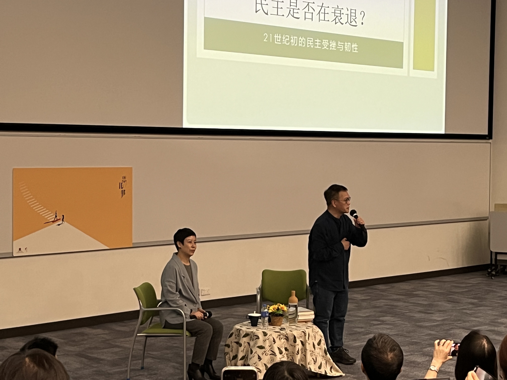

每到年关写年终总结总是相当地头疼，倒不是不想动笔，就是突然要从记忆中抽取一年的回忆过于困难。这个时候我通常会打开友台往期的类似文章来紧急学习一下如何写作（笑）。当我打开手机相册想着回忆一下的时候发现这一年确实过得相对没什么故事性，不过今年过得确实相当充实，在平凡的生活中也有些许点缀。

### 中文大学讲座

一月的香港已经开学，中文大学的学生们也进入了每学年的第二个学期。在新年假期和春节假日期间参加了刘瑜教授在 CUHK 的[讲座](https://icare.cuhk.edu.hk/post/zh-i-care-salon-31st-session?lang=zh)——《民主是否在衰退》。

这个时代能听到有趣的政治学讲座实属不易，特别是周边坐着的是一群和自己相同年纪的大学生，听着他们提出不少问题着实令人兴奋。

### 西南纪行

今年唯一一次长途外游，去了阔别已久的成都和从未踏足的重庆，在成都和可爱的 [Clementine](https://blog.hly0928.com/) 贴贴，这位老成都带我吃了许多本地菜，玩得很开心。

重庆是我一直想去但是之前一直没有去的地方。除开旅游局的大力宣传外，我觉得我对于重庆的想象很大一部分都来自香港（很奇怪），山城、曲折复杂的路、城中栏杆外便是万丈深渊的奇特景象，以及铁道迷喜欢的单轨电车。重庆确实在许多方面与香港有相似之处，同样都有复杂的道路设计、立体的城市设计，重庆也有自己的「梳士巴利道」（嘉陵江北岸洪崖洞顶部），解放碑附近名店银行林立也与中环有几分相似。

除开旅游，这次也有幸去参观了 TESTV 办公总部，我也算是个老粉了，从初二就开始看它们家的数码产品体验节目，真的看到了荧幕背后的场景后反而有种不真实感，现实与想象仍然有差别，当穿越荧幕看到他们真人的时候又是另一副模样。

### Friends: Make acquaintance & Reconnect

今年无疑是开心的一年，我认识了许多新的朋友，也见到了许多认识多年却从未谋面的朋友，甚至在最后的几天也遇到了可爱的人。突然感觉自己还是相当幸福的，2024 有你们相伴真好。我不是一个擅长维护人际关系的人，但是也在笨拙地学习怎么去珍惜和朋友们的感情。

### Finale

今年的年终总结少得可怜，还拖到一月中旬才写完，足以证明总结平凡的一年如此艰难。不过无言不等于生活不充实，今年也有在认真生活。2025 年注定是风云变幻的一年，祝各位在新的一年也能过得开心，不断进步，共勉！

**以上**