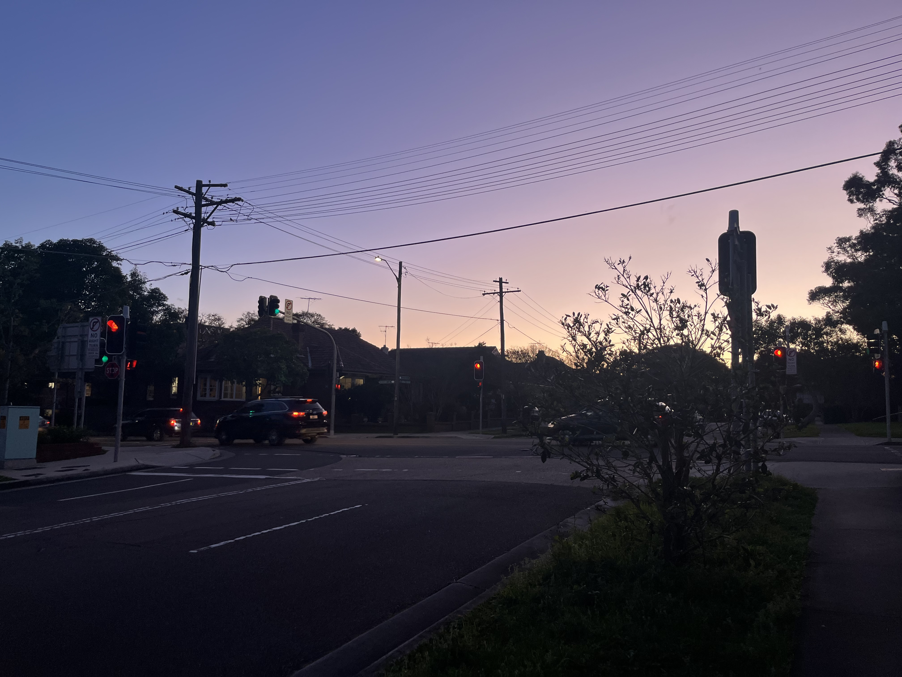

突然有想写一篇博文的缘由有二，一是突然意识到自己来到移居到一个全新的国度已经半年了，二是看到友台[新发的一篇文章](https://with.fish/posts/2025-the-end-of-youth/)突然让我手痒痒打算写点什么。

我已然不知道过去多久没有写过中长文了，不仅仅是因为近半年感到绝大多数日子都过得忙碌且充实，也发现自己没有什么写作的头脑。可能我从来没喜欢过写作，当初建立这个博客平台也是纯粹跟风罢了，「程序员有一个博客也太酷了吧！我也想要一个！」大概是这么个想法。新建一个文档总是简单的，一行命令就行了，但是看到空白的页面和唯一一个闪烁的光标只让我觉得痛苦，也许人生有太多时刻面对的就是这么一个情况，零碎的思绪并不让我兴奋，而面对虚空时的茫然贯穿我的人生。

开始写下这篇文章的时候是三月四日，周三晚上已经把这一个礼拜的课都上完了，因大雨而被困图书馆，写到现在突然感觉手已经在键盘上停不下来了，遂有此文。

## 缘起

想出去留学大概已经是很早就有的想法了，高中的时候就想本科能去香港，上了大学之后又想研究生能去美国，到了最后却选择了澳大利亚，回望之前的想法也会觉得挺有趣的，每个时段自己的心境都有些许不同，但我显然是受够了中国的教育体系了。

除开高中的三年是极度抑郁的时光外，我其实对于中国的教育没有太多生理性的恶心，小学初中傻呵呵地过去了，大学时光除了因为武汉肺炎大瘟疫对生活造成的不便以外也算是自由散漫，也许当时的想法已经开始遗忘了，但是脑袋里有一个声音一直在回荡：「去学 computer science 吧」，显然外语我只会英语，而且自我感觉还不错，就选了啥要求也不要的澳洲作为留学的目的地了，当然我开始也是希望能够留在他乡开启自己的新人生剧本，一年多前的我大概万分期待出去的新生活。

## 新的起点

我对于新鲜事物所感受到的刺激无意是兴奋的，去年的九月一日，我第一次踏上这片新大陆的时候心中充满了忐忑与不安，这是我人生 22 年以来第一次搬离广州，而且是到了一个社会氛围与之前完全不同的国家，在飞机上已经被强烈的阳光照醒，这一来就是全新生活的开始了。

落地第一天的印象尤为深刻，即使是在半年后的今天回想起来也是历历在目，抵达 Sydney 机场，先是移民检查，SmartGate 非常方便，扫护照后通过人脸识别就过去了，本来想找 officer 盖个章，但是那位男入境官员严词拒绝了，没办法只能去提取行李，我发现我在香港机场买的鸡仔饼里面含有动物制品，我就真的认认真真申报了，一个西人海关官员看了我的申报单并再问我只有这个饼干后直接用标准的华语说「六号」并指向查验通道，我还以为会有特殊检查，等我走着走着发现直接离开了禁区我才发现原来六号通道就是不查验。

通过了边防检查过后，我拖着两个大行李箱既疲惫又兴奋，学校提供了免费的机场接送服务还是非常不错的。车外的风景从遍布公寓的 Mascot 经过繁忙的马路驶入了全是独栋房子的小镇，这就是我的新住所了，一个在十字路口旁的大房子。此时我只是付了定金，钥匙和合同都没有拿到，我只能按着 Google Map 去找行李寄存点，不过也不知道是不是数据好几年都没有更新了，连续找了好几家都发现根本没这个地方，问了周边的商户老板也都没问出来。还好在飞机上吃了好多飞机餐（多谢国泰航空把我喂得好饱），中午没吃饭都不觉得饿。我又把两个行李箱拖回来，最终抱着试试看的态度问了一下家附近有个购物中心的物业管理处，没想到对方人很好的直接同意了我寄存行李。

解放了双手之后终于可以干事了，先去 woolies 买电话卡，不过这个电话卡也折腾了我半天，Telstra 的电话卡买了两张都不能用护照激活，搞得我灰头土脸地去找 customer service desk 说明情况来退款；最后试了一下 Optus 一次完成激活（不过讲真我本身挺讨厌电话卡实名制的就是了，整个 prepaid 不用实名就没那么多事了）。

拿到了电话卡然后就去隔壁的银行开户，坐着等了差不多一个小时的样子才排到，好在小镇人不多也有足够的位置坐，大银行开户还是比较麻烦的，把我几乎所有的文件都影印了一份，填了不少东西，搞到分行都关门了才弄完。

这个时候房仲终于来了，拿到钥匙并签署租契后我搬入了房间，刚到埠我倒开始心生疑虑，一进门那鞋架散发着一股臭味，房间里则是那种刺鼻的中东人喜欢喷的香水味，不过这个时候我也顾不得那么多了，简单打扫了一下就把行李铺开。我从窗边望出去，晨昏蒙影映射的天空非常美丽。

不过今天的任务仍然没有结束，我还没有床上用品，这个时候已经七点多了，外边乌漆嘛黑的也没有又领着大袋子出门了，坐巴士去 Bondi Junction ，终于见到了繁华的市镇中心，横跨几条街的购物中心，街道上也是灯火通明，和小镇上的寂静完全不同，购物完成后又是大包小包地拎回家，第一天终于结束了。

## 初见端倪

回想我刚来澳洲的时候，
